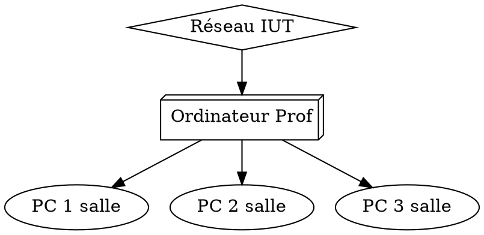

# ProjetRT2

InitNetBoot --> Script permettant d'initialiser le serveur pxe (Dnsmasq --> DHCP, TFTP, DNS) 
iso --> Répertoire contenant les iso de bases 
OUTDATED --> Fausses pistes 
customiso.sh --> script permettant de customiser les iso avant de les diffuser sur le réseau 

---
title: ProjetRT2
---

# 
 ProjetRT2 

## 
 Projet NetBoot 

>[name=Pablo Théo Solen ] [color=#907bf7]
Vous pouvez consulter ce compte rendu à l'adresse suivante (conseillé): 
https://md.iutbeziers.org/s/H1DujdD8I#

>### [Introduction](#intro) 
>### [Etude du fonctionnement de PXE](#PXE) 
>### [Faire une tmpfs (Linux en RAMDISK)](#tmpfs) 
>### [Création d'un script permettant d'automatiser la diffusion de l'iso](#iso) 
>### [Création d'un outil permettant de créer une image adapté pour chaque TP ](#image) 
>### [Déploiement du serveur DHCP ](#DHCP) 
>### [Déploiement du serveur TFTP ](#TFTP) 
>### [Déploiement du serveur NFS](#NFS)
>### [Routage ](#routage) 
>### [Conclusion ](#conclusion) 
>### [Bibliographie ](#bibli) 

## Introduction  
Lorsque nous sommes en TP, nous ne sommes pas toujours dans les mêmes salles. Cela n'est pas sans conséquences, en effet les outils présent sur les différentes machines ne sont pas les mêmes. Il faut soit trouver un équivalent soit instller le bon matériel.

C'est pour cela que Mr Druon nous a proposé ce projet, car il faut répondre à un besoin.

Le but étant que en rentrant en salle de TP, nous disposions d'une machine fonctionnelle, et propre.
## Etude du fonctionnement de PXE 
Nous avons effectué des recherches pour savoir comment nous allions faire.
...

Maintenant il va falloir stocker l'OS que l'on veut déployer. Pour se faire nous avons penser au ramdisk
## Faire une tmpfs (Linux en RAMDISK) 

Maintenant que nous savons ou le stocker il va falloir maintenant essayer de le diffuser à toutes les machines.
## Création d'un script permettant d'automatiser la diffusion de l'iso 
En effet il nous faut maintenant le diffuser à tout les postes.
...
Nous pouvons désormer le diffuser, reste maintenant à l'adapter à chaque TP
## Création d'un outil permettant de créer une image adapté pour chaque TP 
Pour pouvoir l'adapter à chaque TP, nous avons pensé à un script qui permettrait cela.
https://md.iutbeziers.org/w24n8SSKSOmH7BR6MY5M5A#
...
L'OS est en place sur les machines, mais nous faut pouvoir jointre les autres postes, celui du professeur ou encore internet.
## Déploiement du serveur DHCP 
C'est pour cela que nous avons besoin d'une adresse IP, le serveur DHCP nous en fourni une.
...
Cepandant, il nous reste encore à sécuriser les postes et les données de chacun.
## Déploiement du serveur TFTP 
Le serveur TFTP va permettre aux machines connectées au réseaux de récupérer les fichier nécessaires au lancement du système d'exploitation prédéfini.

TFTP est un protocole simplifié de transfert de fichiers.
## Déploiement du serveur NFS 
Nous mettons donc en place un serveur NFS qui permettra aux utilisateurs de sauvergarder leurs donnèes et par la même occasion de s'authentifier.

Network File System (NFS), ou système de fichiers en réseau, est une application client/serveur qui permet à un utilisateur de consulter et, éventuellement, de stocker et de mettre à jour des fichiers sur un ordinateur distant, comme s'ils étaient sur son propre ordinateur.
## Routage 
Voici une illustration du système qui va être établie : 

L'ordinateur du professeur va être une interface à part en tiers du réseau qui va être établi, tous les échanges vont forcéement passer par lui.
Cette mise en place permet de contrôler de nombreux paramètres.
## Conclusion 

Nous avons penser à quelques améliorations notamment celle de mettre les fichiers des élèves sur un cloud pour qu’ils ne dépendent plus de l’ordinateur du professeur.

## Bibliographie 

RAMBoot : https://gist.github.com/avinash-oza/9791c4edd78a03540dc69d6fbf21bd9c

https://wiki.ubuntu.com/BootToRAM

Docu Initramfs : https://www.kernel.org/doc/Documentation/filesystems/ramfs-rootfs-initramfs.txt

Doc 2 : https://wiki.gentoo.org/wiki/Initramfs/Guide/fr

https://lea-linux.org/documentations/Installer_Debian_par_un_boot_r%C3%A9seau

https://rocketboards.org/foswiki/Documentation/BuildingInitramfsForSimpleNetworkBoot

https://linux.developpez.com/formation_debian/nfs.html

https://debian-handbook.info/browse/fr-FR/stable/sect.nfs-file-server.html
